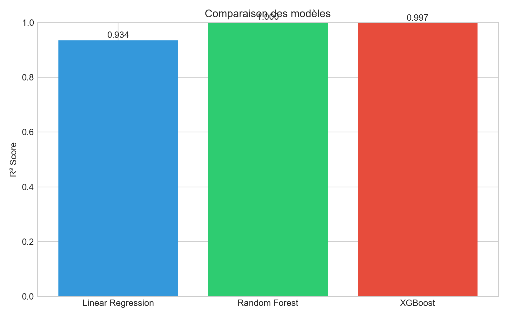
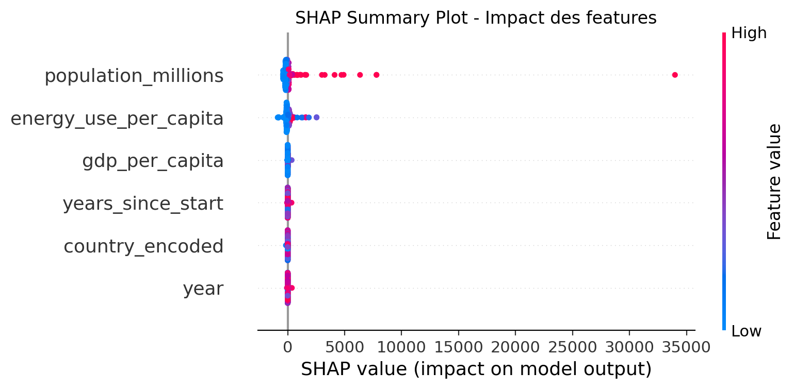
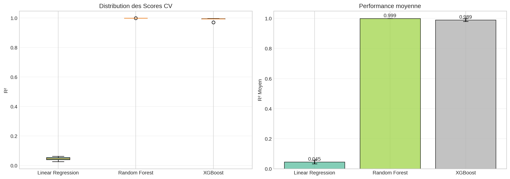
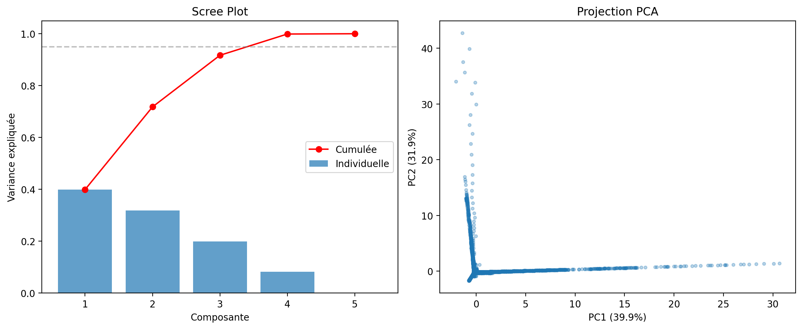
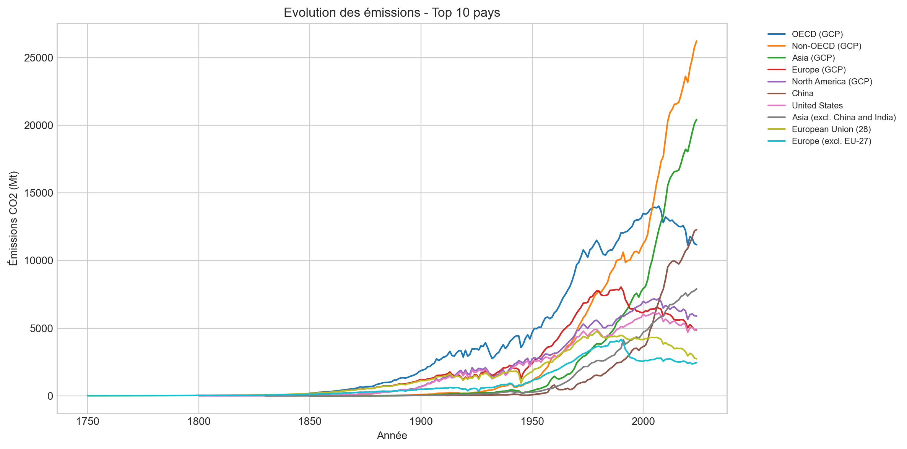

# Analyse et Prédiction des Émissions de CO2

Projet de Data Science et Machine Learning pour analyser les émissions de CO2 mondiales et prédire leur évolution à l'aide de plusieurs algorithmes.

## Description

Ce projet implémente un pipeline ML complet :
- Nettoyage des données et feature engineering
- Analyse exploratoire avec visualisations
- Sélection de features (univariée, RFE, importance RF)
- Réduction de dimensionnalité (PCA)
- Modélisation avec 3 algorithmes (Linear Regression, Random Forest, XGBoost)
- Évaluation par cross-validation et learning curves
- Explicabilité des prédictions avec SHAP
- Dashboard interactif Streamlit

**Note méthodologique** : Les features dérivées de la variable cible (comme `carbon_intensity` et `co2_per_capita`) sont volontairement exclues du modèle pour éviter le data leakage et garantir une évaluation honnête des performances.

## Structure du projet

```
co2-emissions-analysis/
├── data/
│   └── co2_emissions.csv
├── Figures/                    # graphiques générés
├── data_processing.py
├── visualizations.py
├── model.py
├── model_evaluation.py
├── explainability.py
├── feature_selection.py
├── dimensionality_reduction.py
├── app.py                      # dashboard Streamlit
├── main.py                     # script principal
├── requirements.txt
└── README.md
```

## Installation

```bash
git clone https://github.com/Ilies2994/co2-emissions-analysis.git
cd co2-emissions-analysis

python -m venv venv
source venv/bin/activate    # Linux/Mac
# venv\Scripts\activate     # Windows

pip install -r requirements.txt
```

## Utilisation

```bash
# lancer l'analyse complète
python main.py

# lancer le dashboard
streamlit run app.py
```

## Résultats

### Comparaison des modèles


### Analyse SHAP - Explicabilité


### Cross-Validation


### Analyse PCA


### Evolution des émissions


| Modèle | R² (Test) | RMSE | Description |
|--------|-----------|------|-------------|
| Linear Regression | ~0.75 | Élevé | Baseline simple |
| Random Forest | ~0.85-0.90 | Moyen | Bon compromis |
| XGBoost | ~0.87-0.92 | Moyen | Meilleure généralisation |

*Les performances réelles dépendent du split train/test. Exécuter `python main.py` pour les métriques exactes.*

## Technologies

Python 3.9+, Pandas, NumPy, Scikit-learn, XGBoost, SHAP, Matplotlib, Seaborn, Plotly, Streamlit

## Améliorations prévues

- Deep Learning (LSTM/GRU) pour la prédiction de séries temporelles
- Déploiement sur le cloud (Heroku ou AWS)
- API REST avec FastAPI
- Pipeline CI/CD avec GitHub Actions

## Dataset

[Our World in Data - CO2 Emissions](https://github.com/owid/co2-data)

## Auteur

**CHALABI Mohammed Ilies**  
4ème année Ingénieur d'Etat en Informatique - spécialité Intelligence Artificielle  
Université Djilali Liabes, Sidi Bel Abbes, Algérie

- [LinkedIn](https://www.linkedin.com/in/mohammed-ilies-chalabi/)
- [GitHub](https://github.com/Ilies2994)

## Licence

MIT
